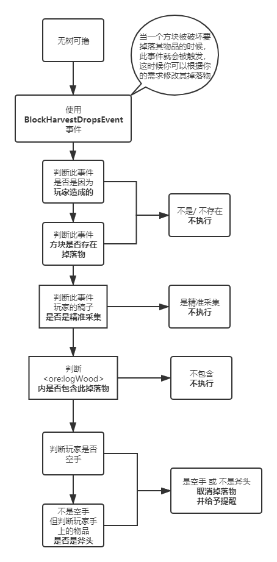

# 案例 - 无树可撸

 **1 - 案例需求：**

如果玩家空手或者拿的不是斧头破坏原木，则不掉落任何东西。

**2 - 流程解析：**




**3 - 代码实现**

```typescript
#loader crafttweaker reloadableevents

//导包
import crafttweaker.item.IItemStack;
import crafttweaker.player.IPlayer;
import crafttweaker.event.BlockHarvestDropsEvent;

events.onBlockHarvestDrops(function(event as BlockHarvestDropsEvent) {
    //定义变量
    var player as IPlayer = event.player;
    
    //基本逻辑判断，不符合则跳过
    if(!event.isPlayer || event.drops.length == 0 || event.silkTouch) return;
    //因为drops是一个数组，原木破坏也只有一个，所以我们取它的第一位元素进行判断
    if(<ore:logWood>.matches(event.drops[0].stack)){
        if(isNull(player.currentItem) || !(player.currentItem.toolClasses has "axe")){
            event.drops = [];
            player.sendChat("无 树 可 撸");
        }
    }
});
```

**4 - 补充细节** 

虽然这部分已经完善了，但实际上我仍旧是不小心的遗漏了一个判断。

这个判断是在我完善流程图和代码后忽然想起发现的。虽然下面会贴出正确答案，但我仍希望你也能先停下来仔细思索一下到底是遗漏了什么判断，再去寻看答案。


遗漏了真假玩家的判断，如果我们不进行此处判断，一些机械（比如ExU2的使用者）在破坏木头的时候同样是不会掉落任何掉落物。

```typescript
//判断如下:
if(player.isFake()) return;
```

