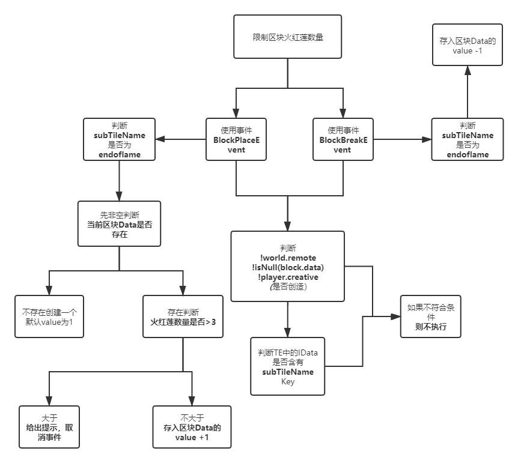

# 案例 - 限制区块火红莲数量

 **1 - 案例需求：**

每个区块内只能存在四个火红莲，多了则不允许被放置。

**2 - 流程解析：**

在进行流程图之前，我们得先对我们的需求有一个大概的分析.

首先，区块限制能先想到的是 [ZenUtils](https://www.curseforge.com/minecraft/mc-mods/zenutil) 提供向区块内读写自定义的NBT数据。

然后，我们得知道火红莲是一个TE（TileEntity），并且和其他产能花占用的方块ID是一致，它们间的区分是NBT，因此我们不能直接通过判断ID的方式去对比，因此我们应该从TE的IData角度下手判断。

```typescript
//火红莲的IData输出，浮空和非浮空的IData区别仅限为ID
{
	x: -85,
	subTileCmp: {
		passiveDecayTicks: 0,
		mana: 0,
		ticksExisted: 0,
		burnTime: 0,
		collectorZ: 0,
		collectorY: -1,
		collectorX: 0
	},
	y: 43,
	subTileName: "endoflame",
	z: -43,
	id: "botania:specialflower"
}
```

关于如何获取到TE的数据，可以运用 [FTBUtilities](https://www.curseforge.com/minecraft/mc-mods/ftb-utilities) 的功能，也可以用CrT自带的`/ct nbt` 或 `/ct blockinfo`，这里就不多赘述。

明确了需求和基本条件后，我们便可以进行流程图的绘制工作了：



**3 - 代码实现**

```typescript
#loader crafttweaker reloadableevents

//导包
import crafttweaker.world.IWorld;
import crafttweaker.block.IBlock;
import crafttweaker.world.IBlockPos;
import crafttweaker.player.IPlayer;
import crafttweaker.data.IData;
import crafttweaker.potions.IPotion;
import crafttweaker.potions.IPotionEffect;

import mods.ctutils.utils.Math;

import crafttweaker.events.IEventManager;
import crafttweaker.event.BlockBreakEvent;
import crafttweaker.event.BlockPlaceEvent;

//方块破坏事件
events.onBlockBreak(function(event as BlockBreakEvent){
    var world as IWorld = event.world;
    var player as IPlayer = event.player;
    var pos as IBlockPos = event.position;
    //读取TE数据必须要通过IWorld.getBlock(pos)来获取
    var block as IBlock = world.getBlock(pos);
    var worldData as IData = world.getCustomChunkData(pos);

    //判此处判断对应流程图
     if(!world.remote && !player.creative && !isNull(block.data)){
        if(block.data has "subTileName"){
            if(block.data.subTileName.asString() == "endoflame"){
                //判断符合，data-1
                //因为创造模式是不会产生data数据，所以不需要非空判断
                var upDate as IData = {endoflame : worldData.endoflame.asInt() - 1};
                world.updateCustomChunkData(upDate, pos);
            }
        }
    }
});

//方块放置事件
events.onBlockPlace(function(event as BlockPlaceEvent){
    var world as IWorld = event.world;
    var player as IPlayer = event.player;
    var pos as IBlockPos = event.position;
    //读取TE数据必须要通过IWorld.getBlock(pos)来获取
    var block as IBlock = world.getBlock(pos);
    var worldData as IData = world.getCustomChunkData(pos);
    
    //判此处判断对应流程图
    if(!world.remote && !isNull(block.data) && !player.creative){
        if(block.data has "subTileName"){
            if(block.data.subTileName.asString() == "endoflame"){
                if(!(worldData has "endoflame")){// 第一次
                    world.setCustomChunkData({endoflame : 0}, pos);
                    var upDate as IData = {endoflame : 1};
                    world.updateCustomChunkData(upDate, pos);
                }else if(worldData.endoflame.asInt() > 3){// >3
                    player.sendChat("此区块火红莲已达上限");
                    event.cancel();
                }else{// <3
                    var upDate as IData = {endoflame : worldData.endoflame.asInt() + 1};
                    world.updateCustomChunkData(upDate, pos);
                }
            }
        }
    }
});

```

**4 - 补充细节** 

这个事件的难度较低，没有遗漏的情况，主要考验的是对于IData数据的处理。

唯一需要注意的点就是：**一定不要漏过任何存在的空处理**，不然将会是一大堆的**NULL**报错等着你。

